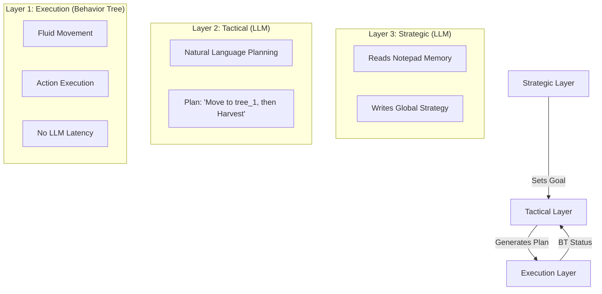

# MASTER ROADMAP - Civilization Agent Project

> **Document Status**: ORCHESTRATION GUIDE  
> **Last Updated**: 2025-12-27  
> **Purpose**: This is the STARTING POINT for any new LLM session. Start here.

---

## WHAT IS THIS PROJECT?

A **god-game** where the player guides AI agents who build a civilization from scratch on a stranded island.

**Current State**: Full 3-Layer AI Architecture & Modular Codebase (2025-12-28)  
**Target State**: Social interactions and Day/Night cycle implementation

---

## 📁 DOCUMENT MAP (READ THESE)

```
┌──────────────────────────────────────────────────────────────┐
│                MASTER_ROADMAP.md (YOU ARE HERE)              │
│             Start here to understand the context             │
└──────────────────────────────┬───────────────────────────────┘
                               │
            ┌──────────────────┼───────────────────┐
            ▼                  ▼                   ▼
┌────────────────────────┐┌──────────────────┐┌────────────────┐
│ docs/ARCHITECTURE.md   ││docs/AI_RESEARCH_ ││ KNOWN_BUGS.md  │
│                        ││LOG.md            ││                │
│ Technical Reference    ││AI optimization   ││ Current issues │
│ - 3-layer system       ││& decision log    ││ & blockers     │
│ - BT nodes & logic     │└──────────────────┘└────────────────┘
└────────────────────────┘
```

---

## OVERALL ROADMAP

### Phase 1: Foundation ✅ COMPLETE

- [x] Extended agent stats (warmth, food, health, energy)
- [x] Inventory system & Resource harvesting
- [x] Basic crafting & buildings (campfire, shelter)

### Phase 2: AI Architecture & Clean Code ✅ COMPLETE

- [x] 3-Layer AI architecture (Strategic / Tactical / Execution)
- [x] Dynamic Behavior Tree execution engine
- [x] Codebase modularization (Engine.js, World.js, UIManager.js)
- [x] PubSub Event system for decoupled UI updates
- [x] Per-agent notepad system with persistence

### Phase 3: Social & Advanced (NEXT)

- [ ] Trust/relationship system
- [ ] Cooperation mechanics
- [ ] Day/night cycle vs Warmth mechanics
- [ ] Trading system

### Phase 3: Social & Advanced (NEXT)

- [ ] Trust/relationship system
- [ ] Cooperation mechanics
- [ ] Day/night cycle vs Warmth mechanics
- [ ] Trading system

---

## THE AI VISION (3-LAYER ARCHITECTURE)

We are building a cognitive architecture that balances long-term planning with fluid execution.



1.  **Strategic Layer (Every 3-5 cycles)**: High-level reasoning. "I am low on wood, I should focus on gathering for a campfire."
2.  **Tactical Layer (Every cycle or when plan fails)**: Breaks strategy into 3-5 concrete steps.
3.  **Execution Layer (Tick based)**: A Behavior Tree executes the tactical plan. This ensures agents don't "stutter" while waiting for LLM responses.

## WHAT TO WORK ON NEXT

### If you're a NEW LLM session:

1. **Read this document first** (you're doing that now)

2. **Read the LLM Control Architecture**:  
   → [llm_controll_ideation.md](./llm_controll_ideation.md)  
   This has the finalized 3-layer architecture with strategic/tactical prompts and notepad system.

3. **Read the Feature Implementation Plan**:  
   → [feature_implementation_plan.md](./feature_implementation_plan.md)  
   This has the SPECIFIC FEATURES to implement, with code examples.

4. **Ask the user what to work on**:  
   Likely options:
   - Start Phase 1 (foundation): Implement extended stats, inventory, harvesting
   - Start Phase 2: Create world_rules.md document
   - Bug fixes: Check KNOWN_BUGS.md (current state might be irrelevant when all these changes are implemented)

---

## IMMEDIATE NEXT STEPS (Recommended Order)

### Step 1: Create world_rules.md

**Why**: Both LLM architecture and game features need this as a reference.  
**How**: See the example structure in llm_controll_ideation.md  
**Ask user**: What survival stats should exist? What recipes?

### Step 2: Extend Agent Stats

**Why**: Foundation for warmth/cold gameplay  
**How**: See Feature 1.1 in feature_implementation_plan.md

### Step 3: Add Inventory System

**Why**: Need this before crafting can work  
**How**: See Feature 1.2 in feature_implementation_plan.md

### Step 4: Make Resources Harvestable

**Why**: Trees give wood, rocks give stone  
**How**: See Feature 1.3 in feature_implementation_plan.md

### Step 5: Add Crafting

**Why**: Let agents build shelters, tools  
**How**: See Feature 1.4 in feature_implementation_plan.md

### Step 6: Implement Notepad System

**Why**: Central to the new LLM architecture  
**How**: See Feature 2.2 in feature_implementation_plan.md

### Step 7: Refactor to 2-Prompt System

**Why**: Separate strategic vs tactical thinking  
**How**: See Features 2.3 and 2.4 in feature_implementation_plan.md

### Step 8: Implement Behavior Trees

**Why**: Smooth execution without LLM latency  
**How**: See Feature 2.5 in feature_implementation_plan.md

---

## PROJECT STRUCTURE

```
agent-map/
├── main.js                 # Entry point, game loop, rendering [UPDATED]
├── server.js               # Ollama bridge with world rules [UPDATED]
├── index.html              # HTML entry
├── style.css               # Styling
│
├── src/
│   ├── ai/
│   │   ├── brainLoop.js    # LLM decision loop (in main.js now)
│   │   └── actions.js      # Action execution [UPDATED]
│   ├── entities/
│   │   ├── Agent.js        # Agent with extended stats [UPDATED]
│   │   ├── Seed.js         # Seed entity
│   │   ├── ResourceNode.js # Trees, rocks, berry bushes [NEW]
│   │   └── Building.js     # Campfire, shelter [NEW]
│   ├── systems/
│   │   ├── Inventory.js    # Inventory management [NEW]
│   │   └── Crafting.js     # Recipes and crafting [NEW]
│   ├── config.js           # Game configuration [UPDATED]
│   ├── game_presets.js     # Pacing/abundance presets [NEW]
│   └── agent_names.js      # Random name generation [NEW]
│
├── context/                # LLM Context
│   └── world_rules.md      # Game mechanics for LLM [NEW]
│
├── agents/                 # Agent memory
│   └── notepad_template.md # Per-agent notepad [NEW]
│
└── docs/
    ├── MASTER_ROADMAP.md           # This file
    ├── WORK_LOG.md                 # Implementation log [NEW]
    ├── llm_controll_ideation.md    # LLM architecture design
    └── feature_implementation_plan.md  # Feature backlog
```

---

## KEY ARCHITECTURAL DECISIONS (Already Made)

| Decision     | Choice                                    | Reference                         |
| ------------ | ----------------------------------------- | --------------------------------- |
| LLM Hosting  | Local Ollama (gemma3:4b)                  | No API costs                      |
| LLM Strategy | 1 model, 2 prompts (strategic + tactical) | llm_controll_ideation.md          |
| Agent Memory | Personal notepad files (read-write)       | llm_controll_ideation.md          |
| Execution    | Behavior Trees (no LLM for movement)      | llm_controll_ideation.md          |
| Context      | world_rules.md shared document            | llm_controll_ideation.md          |
| Agent Count  | 5-20 agents planned                       | Event-triggered + staggered calls |

---

## TECHNICAL CONSIDERATIONS

### Running the Project

```bash
# Start Ollama (if not running)
ollama run gemma3:4b

# Start the server
node server.js

# Open in browser
# Navigate to http://localhost:3000 (or open index.html)

# In browser console:
window.game.startAI()
```

### Key Files to Understand

1. **main.js** - Main game loop, rendering, initialization
2. **src/entities/Agent.js** - Agent state and behavior
3. **src/ai/brainLoop.js** - Current LLM decision-making
4. **src/config.js** - All tuning parameters
5. **server.js** - Ollama API bridge

---

## HOW TO USE THIS DOCUMENT

### For a NEW LLM:

1. Read this summary first
2. Read the linked documents as needed
3. Ask the user what to work on
4. Update the corresponding document as you make progress
5. Keep this roadmap updated with completed tasks

### For the USER:

1. Point new LLMs to this file first
2. Use the checklist above to track progress
3. Update this file when priorities change

---

## OPEN QUESTIONS FOR USER

Before implementing features, you may want to decide:

1. **Game Pacing**: How fast should stats decay? (Currently food only)
2. **Resource Abundance**: How many trees/rocks on the map?
3. **Crafting Complexity**: Start with 2-3 recipes or full list?
4. **Agent Names**: Keep "Pioneer"/"Settler" or custom names?
5. **Visual Style**: Keep minimalist cubes or evolve visuals?

## USER ANSWERS:

1. Game Pacing: Create 3 different paces (fast, medium, slow) and let the user choose via config file which can be adjusted later by the user (default: medium)
2. Resource Abundance: Create 3 different abundances (low, medium, high) and let the user choose via config file which can be adjusted later by the user (default: medium)
3. Crafting Complexity: Start with 2-3 recipies but create the structure in a way so it's easily expandable
4. Agent Names: Make them customizable via config file (give them human names come up with some for a starter but create a config file for it where the user can create a list of names and the programm choses randomly)
5. Visual Style: Keep minimalistic - we will work on the visuals later

---

_This document should be updated whenever major project direction changes occur._
